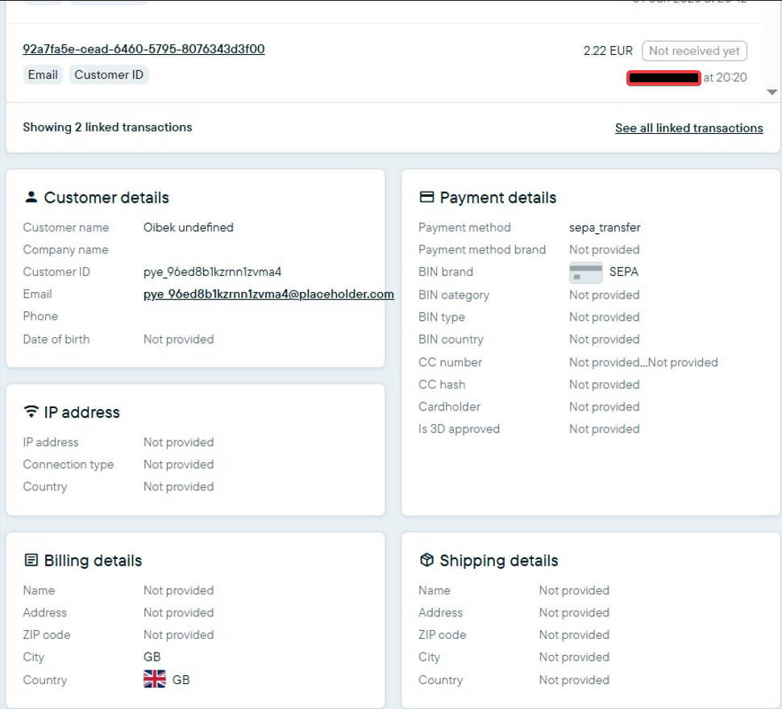
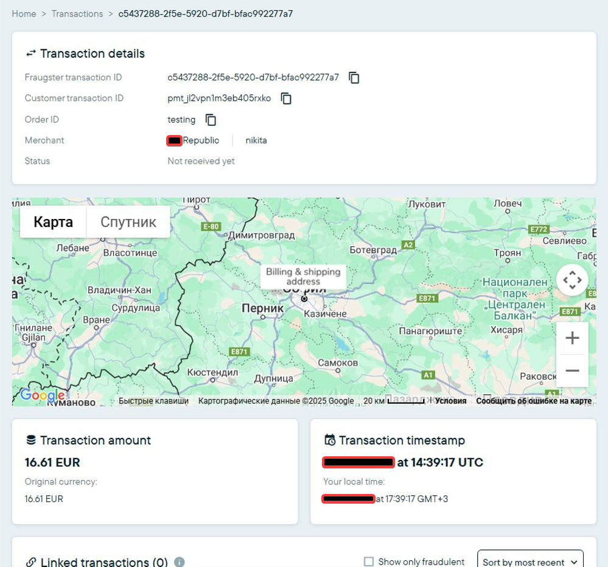
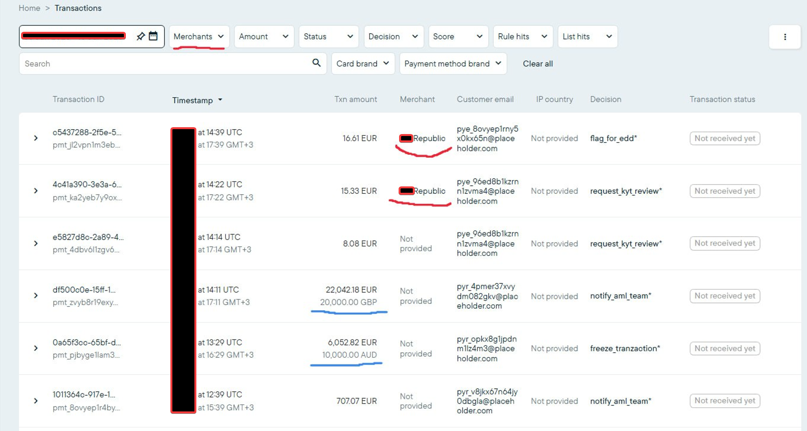
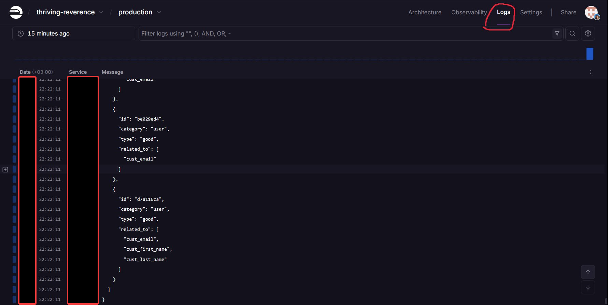

# Payment Service → Fraud Detection Integration

## About This Project

This is a demonstration project showcasing webhook integration patterns between payment systems and fraud detection services. The solution implements production-ready security patterns, comprehensive error handling, and scalable architecture.

#### ⚠️ IMPORTANT: This repository contains only technical implementation examples with no real credentials, business logic, or proprietary information.

### Real-time transaction processing system integrating payment platform with fraud detection service.

## System Overview

<div align="center">
  <a href="screenshots/image_1.png"></a>
  <a href="screenshots/image_2.png"></a>
  <a href="screenshots/image_3.png"></a>
  <a href="screenshots/image_4.png"></a>
</div>

## Architecture

```
Payment Service → Webhook → Express.js → Fraud Detection API
                  (HMAC)    (enrichment)     (analysis)
```

### System Components

**Controllers:**

- **WebhookController**: Handles HTTP requests from Payment Service

**Services:**

- **WebhookService**: Main business logic for transaction processing
- **PaymentService**: OAuth authorization and API interaction
- **FraudService**: Session authentication and data submission

**Middleware:**

- **validateWebhook**: HMAC-SHA256 signature verification
- **validatePayJson**: JSON payload structure validation
- **security**: CORS, Helmet, rate limiting, request size limit
- **errorHandler**: Global error handling and 404 responses

**Utilities:**

- **logger**: Winston-based logging with file rotation
- **TransactionLogger**: Specialized transaction logging

**Types:**

- **payment.types.ts**: TypeScript types for Payment Service API
- **fraud.types.ts**: TypeScript types for Fraud Detection API

## Environment Requirements

- Node.js 18+
- TypeScript 5.3+
- Express.js 4.18+
- Winston 3.11+ (logging)
- Axios 1.6+ (HTTP client)

## Installation

```bash
# Install dependencies
npm install

# Build project
npm run build

# Run in production
npm start

# Run in development mode
npm run dev

# Test webhook
npm run test:webhook
```

## Environment Variables

```env
PORT=3000
NODE_ENV=production

PAYMENT_API_URL=http://localhost:8080
PAYMENT_CLIENT_ID=your_client_id
PAYMENT_CLIENT_SECRET=your_client_secret
PAYMENT_WEBHOOK_SECRET=your_webhook_secret

FRAUD_API_URL=https://api.fraud-detection.com
FRAUD_USERNAME=your_username
FRAUD_PASSWORD=your_password
```

## API Endpoints

### POST /webhook

Main endpoint for receiving webhooks from Payment Service.

**Headers:**

- `Content-Type: application/json`
- `digest: sha1_hash_of_body`
- `signature: fr1=:hmac_signature:`
- `signature-input: fr1=("digest");created=timestamp`

**Response:**

- `200 OK` - Transaction processed successfully
- `401 Unauthorized` - Invalid signature or missing headers
- `400 Bad Request` - Invalid data structure
- `500 Internal Server Error` - Processing error

### GET /health

Service health check.

**Response:**

```json
{
  "status": "healthy",
  "timestamp": "2025-06-19T13:55:25.091Z",
  "version": "1.0.0"
}
```

## Security

### HMAC Signature Validation

All webhooks are verified using HMAC-SHA256 signatures:

1. SHA1 hash is calculated from request body
2. Signature string is created: `"digest": "hash"\n@signature-params: params`
3. Signature is verified using secret key

### Smart Rate Limiting

- **Limits**: 100 requests/minute for webhook endpoint
- **Skip logic**: Automatically skips requests with User-Agent containing "payment-service" or "webhook"
- **SlowDown**: After 50 requests adds 200ms delay (maximum 2 seconds)
- **Response**: Returns 429 with `retry-after` headers
- **Scope**: Applied only to `/webhook`, health endpoint without restrictions

### CORS Policy

Only requests from Payment Service domains are allowed:

- `http://localhost:3000`
- `http://localhost:8080`
- `http://localhost:4000`
- `http://localhost:5000`

**Settings:**

- **Methods**: `POST` only
- **Headers**: `Content-Type`, `Authorization`, `digest`, `signature`, `signature-input`
- **Credentials**: `false`
- **Logging**: Blocked requests are logged with `cors_blocked` event

### Security Headers

- Content Security Policy
- HSTS (31536000 seconds)
- X-Frame-Options
- X-Content-Type-Options
- Request Size Limit (1MB)

## Logging

System logs all important events:

- **logs/transactions.log** - Main transaction events (50MB x 30)
- **logs/error.log** - System errors (10MB x 10)
- **logs/combined.log** - All events (20MB x 15)

### Event Types

**Main events:**

- `webhook_received` - Webhook received from Payment Service
- `signature_validation` - HMAC signature verification
- `fraud_response` - Response from Fraud Detection API
- `processing_error` - Processing errors

**Validation and security:**

- `json_validation_failed` - JSON structure error
- `json_validation_warning` - Validation warnings
- `webhook_validation_failed` - Signature verification error
- `validation_errors` - Fraud Detection data validation errors
- `rate_limit_exceeded` - Rate limit exceeded
- `cors_blocked` - CORS blocked
- `request_too_large` - Request size exceeded

**System events:**

- `server_start` - Server startup
- `startup_error` - Startup error
- `global_error` - Global error
- `route_not_found` - Route not found
- `auth_error` - Authentication error
- `api_error` - API error
- `payment_oauth_error` - Payment Service OAuth error
- `session_token_expired` - Session token expired
- `transaction_stats` - Transaction statistics

## Monitoring

### Health Check

```bash
curl https://your-domain.com/health
```

### Application Logs

```bash
tail -f logs/transactions.log
tail -f logs/error.log
```

### Performance Metrics

- Request processing: ~50-100ms
- Throughput: up to 100 RPS
- Memory usage: ~50-100MB
- Trust proxy: 1 level (Railway compatible)

## Error Handling

### Graceful Shutdown

Server properly handles SIGTERM and SIGINT signals for graceful shutdown in production environment.

### Environment Validation

Required environment variables are automatically checked at startup:

- `PAYMENT_WEBHOOK_SECRET`
- `PAYMENT_CLIENT_ID`
- `PAYMENT_CLIENT_SECRET`
- `FRAUD_USERNAME`
- `FRAUD_PASSWORD`

If any variable is missing, server terminates with `startup_error`.

### Error Recovery

- Automatic `logs/` directory creation at startup
- All errors logged for further analysis
- Graceful error handling in middleware chain
- Complete error context preservation (headers, IP, stack trace)

## Troubleshooting

### Signature Issues

- Check `PAYMENT_WEBHOOK_SECRET` correctness
- Ensure `digest`, `signature`, `signature-input` headers are present
- Events: `webhook_validation_failed`, `signature_validation`

### JSON Validation Errors

- Check payload structure (required fields: `id`, `event`, `data`)
- Events: `json_validation_failed`, `json_validation_warning`

### Fraud Detection Authentication Errors

- Ensure `FRAUD_USERNAME` and `FRAUD_PASSWORD` are correct
- Events: `auth_error`, `session_token_expired`

### Rate Limiting Issues

- Check User-Agent headers (should contain "payment-service" or "webhook")
- Events: `rate_limit_exceeded`, `request_too_large`

### CORS Issues

- Verify requests come from allowed Payment Service domains
- Events: `cors_blocked`

### API Errors

- Fraud Detection API: events `api_error`, `validation_errors`
- Payment Service API: events `payment_oauth_error`, `payment_api_error`

## Production Deployment

### Railway

1. Create new project in Railway
2. Connect Git repository
3. Configure environment variables
4. Deployment will happen automatically

### Environment Variables

Ensure all variables are configured for production:

- `PAYMENT_API_URL` should point to your API server
- Use production credentials for all services
- Set `NODE_ENV=production`

### Webhook Configuration in Payment Service

- **URL**: `https://your-app.up.railway.app/webhook`
- **Events**: `PAYMENT.UPDATED`, `PAYMENT.CREATED`, `PAYMENT.STATUS_UPDATED`
- **Secret**: Use generated secret key

## Versioning

Version: 1.0.0 (Production Ready)

### Main Dependencies

**Runtime:**

- express: 4.18.2
- axios: 1.6.7
- winston: 3.11.0
- helmet: 7.1.0
- cors: 2.8.5
- express-rate-limit: 7.1.5
- express-slow-down: 2.0.1
- dotenv: 16.4.1

**Development:**

- typescript: 5.3.3
- nodemon: 3.0.3
- ts-node: 10.9.2
- @types/express: 4.17.21
- @types/cors: 2.8.17
- @types/node: 20.11.16

## Architectural Decisions

### Trust Proxy Configuration

```typescript
app.set("trust proxy", 1);
```

### Rate Limiting Strategy

**webhookRateLimit configuration:**

```typescript
windowMs: 1 * 60 * 1000,
max: 100,
skip: (req) => {
  const userAgent = req.get("User-Agent") || "";
  return userAgent.includes("payment-service") || userAgent.includes("webhook");
}
```

**webhookSlowDown configuration:**

```typescript
windowMs: 1 * 60 * 1000,
delayAfter: 50,
delayMs: () => 200,
maxDelayMs: 2000
```

This configuration ensures security without blocking legitimate webhooks from Payment Service.
